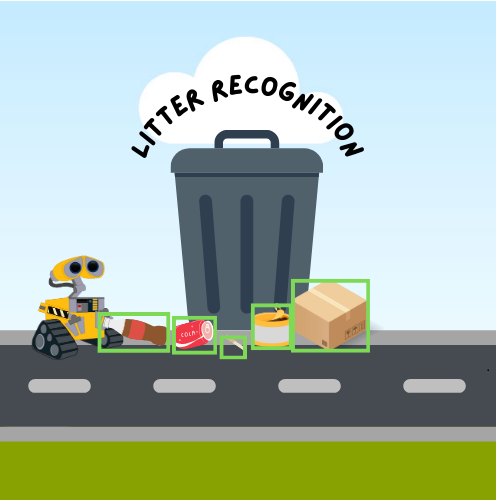
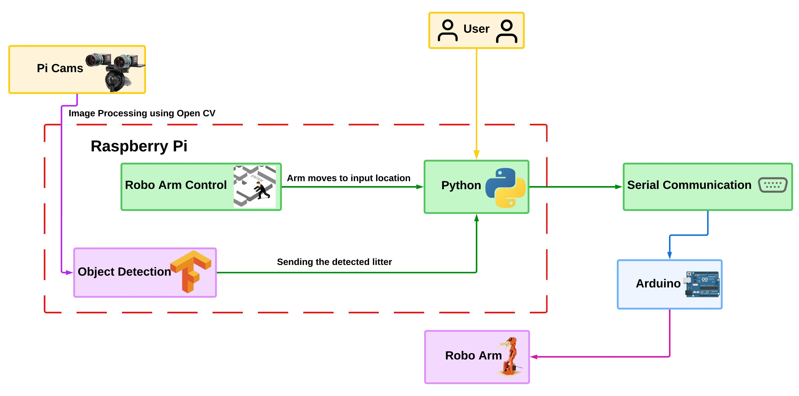

<p align="center">

<h1 id="title">2024-LitterRecognition1</h1>   

[](https://spe-uob.github.io/2024-LitterRecognition1/)
[](https://www.python.org/)
[](https://www.arduino.cc/)


## Contents:
- [Autonomous Litter Recognition System](https://github.com/spe-uob/2024-LitterRecognition1/blob/main/README.md#autonomous-litter-recognition-system)
   - [Problem Statement](https://github.com/spe-uob/2024-LitterRecognition1/tree/main?tab=readme-ov-file#problem-statement)
   - [Project Description](https://github.com/spe-uob/2024-LitterRecognition1/tree/main?tab=readme-ov-file#project-description)
   - [Project Requirements](https://github.com/spe-uob/2024-LitterRecognition1/tree/main?tab=readme-ov-file#project-requirements)
   - [Benefits and Impact](https://github.com/spe-uob/2024-LitterRecognition1/tree/main?tab=readme-ov-file#benifits-and-impact)
   - [Stakeholders](https://github.com/spe-uob/2024-LitterRecognition1/tree/main?tab=readme-ov-file#stakeholders)
   - [User Stories](https://github.com/spe-uob/2024-LitterRecognition1/tree/main?tab=readme-ov-file#user-stories)
   - [Links](https://github.com/spe-uob/2024-LitterRecognition1?tab=readme-ov-file#links)
   - [Project Structure](https://github.com/spe-uob/2024-LitterRecognition1?tab=readme-ov-file#project-structure)
   - [User Instructions](https://github.com/spe-uob/2024-LitterRecognition1?tab=readme-ov-file#user-instructions)
   - [Developer Instructions](https://github.com/spe-uob/2024-LitterRecognition1?tab=readme-ov-file#developer-instructions)
   - [Tech Stack](https://github.com/spe-uob/2024-LitterRecognition1?tab=readme-ov-file#tech-stack)
   - [Architecture Diagram](https://github.com/spe-uob/2024-LitterRecognition1?tab=readme-ov-file#architecture-diagram)
   - [License](https://github.com/spe-uob/2024-LitterRecognition1?tab=readme-ov-file#license)
   - [Group Members](https://github.com/spe-uob/2024-LitterRecognition1/tree/main?tab=readme-ov-file#group-members)


## Problem Statement:
Litter blights our major roads and highways leading to serious environmental and safety issues. Overwhelming litter on the roadsides is mainly
attributed to increased use of non-biodegradable items, unattended
disposal from moving vehicles and regular detachment of plastic undercarriages or mobile vehicle parts (such as tyres). It not only threatens the
endless fauna and fish of our life-filled rivers, but it also
poses a danger to road traffic when potential hazards form at shoulder level.
The way in which litter is managed now is wasteful and dangerous. There exists an urgency to counter this proliferating issue, with the development of a pioneering autonomous litter management solution that can detect and clear road litter efficiently, reducing human intervention while maintaining safety complying environmental impact as well.


## Project Description:
The proposal describes the development of an autonomous litter detection and collection system. This system uses advanced techniques in automation including machine learning, computer vision, and robotics for the automatic detection of litter in grasslands, shrub areas
neighbouring to roads. The technology will be implemented in miniature autonomous vehicle that can operate under various climatic conditions at
the roadside.

**System will incorporate several advanced technologies such as:**
**Computer Vision and Machine Learning:** For detection and classification of litter, Convolutional Neural Networks (CNNs) will be utilised in the analysis of the pictures captured by the cameras. The system will identify various forms of litter while distinguishing them from natural objects such as leaves and rocks.

**Robotic Mechanisms:** The autonomous system will include a robotic arm for collecting litter. These systems will be intended to function properly under harsh and uneven ground conditions which are characteristic of roadside verges.

**Autonomous Navigation:** The robo arm will be placed on autonomous moving vehicle which avoids roadside obstacles.

**Our project aims to create a proof-of-concept iteration of this design with limited features that can be worked upon. We will use a single arm and a computer to produce a system that can identify and pick up key types of litter.**

## Project Requirements:
**Litter Detection:** The system will apply sophisticated image recognisation and object detection methods to locate man-made litter alongside roads. This includes detecting litter both on the ground and in the vegetation such as grass, shrubs, and trees. The detection system shall function irrespective of weather or lighting conditions within the domain of roads construction.

**Litter Classification:** The classified litter will be grouped into various categories, for example, plastic, metal, paper, and other compounds. The classification schema will make a distinction between large objects that can be processed easily (plastic drinking bottles, scraps of cars) and small particle litter (cigarette packets, wrappers of chips). This classification will facilitate planning the most effective retrieval procedure for each waste type.

**Collection Methodology:** The system will analyse and determine the retrieval technique that for larger items such as mechanical arms/grippers and smaller items that will be retrieved by vacuum cleaners/sweepers or combination of both. The retrieval unit system shall be flexible to different litter types and their arrangement on roadside.

**Litter Storage:** Once collected, the system will place the litter into designated storage containers onboard the autonomous vehicle. These
containers will be designed for easy disposal or recycling at regular intervals, reducing the need for frequent manual intervention.

## Benefits and Impact
The deployment of this autonomous litter detection and collection system will have a several pronounced benefits as discussed below:

**Enhanced Safety:** The system safeguards the workers by decreasing the manual litter collection in hazardous roadside areas.

**Reduce Cost:** The reduction of operational costs due to less expensive labor and reduced costly lane closures during manual clean-up procedures will be accomplished through the automation of litter detection and collection, thus increasing efficiency.

**Environmental Protection:** The system will support waste management and recycling efforts by helping to keep litter out of local ecosystems and waterways, as well as preventing pollution issues, which leads to cleaner roadsides.

**Flexibility:** Such a solution provides consistency in litter collection and can be implemented to other freeways and busy zones which helps to address a persistent problem systematically.


## Stakeholders:
**Moss&Gund Ltd:**
* Role: The commissioning group for this project. They will oversee its development and we will meet biweekly to go over our progress.
* Purpose for the System: They would like for the system to be able to recognize and discard 6 keys types of roadside litter into a bag. The group would take the autonomous system to market as a commercial 
  solution using AGILE X systems to make our system mobile.

**General Public:**
* Role: The deployment of the project will most likely affect them as the system will be working on the same roads.
* Purpose for the System: They are not direct users, but the general public do stand to benefit in terms of cleaner roads, reduced litter and improved public safety on the motorways and highways. The system 
  will be required to consider the needs of the public.

**Government Agencies and Road Maintenance Authorities:**
* Role: They are the biggest beneficiaries of the system, and they would ensure that their utilization of the system would lead to maintaining the roads and protecting the environmental 
  concerns associated with roadside litter.
* Purpose for the System: The authorities will apply the system to improve their current workflow of dispatching groups of litter collectors late at night. They have to clean the road side by side, along with 
  closing the road and inefficient gathering. The new system is targeted to automate this process for cost reductions and efficiency.

**Environmental Research Institutes:**
* Role: Scientists will be more interested in the data generated through the implementation of the system and its effect on pollution and local wildlife.
* Purpose for the System: Institutions may be a keen observer of the system and the results to assess the ability of the system to respond effectively to the reduction in pollution and conservation of nature at 
  the local level. Data collected may be found useful in determining the progress made in conservation. 

## User Stories:
**As a client, I want..**
 * A system that will identify a wide variety of roadside litter and identify how to deal with it.

**As a Waste Management Contractor, I want to..**
 * Integrate autonomous litter collection vehicles into my operations, so that I can reduce the cost and risk of manual roadside litter collection.
 * Litter types classified correctly by the system so that I have better management of recycling and waste disposal processes.

**As a member of the public I want.**
 * A safe and contained system not impeding my use of the road.

**As an Environmental Protection Agency official, I want to..**
 * I want a system which has the capability for quick identification and collection of non-biodegradable litter so that I am able to ensure cleaner environments and the reduction of the impact of pollution on wildlife and ecosystems as much as possible.

**As a student, I want to..**
 * Create a proof of concept for an autonomous litter detection and disposal system so that I can utilize knowledge in computer
    vision and robotics in a meaningful project.


  
## Links:
- [Kanban Board](https://github.com/orgs/spe-uob/projects/219)
- [Gantt Chart](https://github.com/orgs/spe-uob/projects/219/views/2)


## Project Structure
```bash

2024-LitterRecognition1
├── .github/             # Templates and workflows
├── .gitignore           # Other files
├── LICENSE              ...
├── README.md            ...
├── Research/            # Research files
├── code/                # All project code
└──  docs/                # Project documentation 
```
More details can be found using the 'Handover Documentation' link at the top or by looking at the README in /docs.

## User Instructions

**Requirements**: 
- [Python](https://www.python.org/downloads/),
- [Arduino IDE](https://www.arduino.cc/en/software),
- Arduino UNO and a Braccio robot arm
- Two cameras of the exact same specification,
- A computer with enough processing power to run the detection,
- An object displaying an 8 by 6 (measured by interior vertices) chessboard pattern.
  
Download the latest release of the project onto your device.

Connect your arm to the Arduino and power it on.

Open the arduino_script.ino file in the arduino IDE and click Upload in the top right. The arm should now move to the safety position.

Now navigate to the directory the python files are stored in on your machine via command line and run 

```console
cd 2024-LitterRecognition1/code/StereoVision
```

Then:

```console
python take_Images.py
```

This should then display the two camera feeds on your screen. From here you will need to take a minimum of 5 photos by pressing the 's' key.

> [!IMPORTANT]
> Pictures must include the chessboard at different orientations and angles in every frame. For example, the first picture could just be the chessboard held to the middle of the frame, while another could have the chessboard held to the corner of one of the cameras at an angle. Examples can be found in:

```bash
2024-LitterRecognition1
├── code/          
│   ├── StereoVision/
|   |   ├── calibration_images
|   |   |   ├── left  # HERE
|   |   |   ├── right # HERE
```

### Step 2: Calibrate your Cameras
Once the images have been taken, they should be saved into the local files 'left' and 'right' like above. Now run:

```console
python calibration.py
```

This should show a series of frames with openCV having detected the chessboard corners in the images you took earlier. These corner locations are used to create a local file 'stereoMap.xml' needed to rectify the images which will be taken while running the depth and image detection. This file can be reused whenever now that you have calibrated the two cameras.

### Step 3: Run the Detection Script
Now that you have completed the preliminary tasks, all you need to do is run:

```console
cd ..
```
Then:

```console
python -m StereoVision.distInf
```

This script runs real time inference on the camera feeds using the TFlite TACO-trained model powering our project. If both frames detect an object, the distance of this object should be calculated and displayed with the help of the rectification parameters you calculated via the calibration script.


**If you would like to control the arm manually, run:**

```console
python interface.py
```
Now enter the port as displayed in the Arduino IDE.
A PyGame window will now open.

To control the arm for debugging:
   w/s -- open/close the claw
   a/d -- twist wrist
   i/k -- move arm forwards and backwards in horizontal plane
   j/l -- move arm left and right in horizontal plane
   u/o -- move arm up and down

To pick up from specific coordinates:
Press "m" to select coordinates screen, then enter the x,y,z coordinates when prompted (in millimetres, (0,0,0) is at the middle of the shoulder joint). The arm will then perform the pick up procedure.


## Developer Instructions
**Requirements**: 
- [Python](https://www.python.org/downloads/),
- [Arduino IDE](https://www.arduino.cc/en/software),
- The libraries present within /code/requirements.txt,
- Arduino UNO and a Braccio robot arm,
- Two cameras of the exact same specification,
- A computer with enough processing power to run the detection,
- An object displaying an 8 by 6 (measured by interior vertices) chessboard pattern.
  

All code can be found within the /code file of the GitHub and the fully built tflite model can be found within code/Model.

A much more detailed description of the codebase can be seen in the handover documentation found at the link at the top of the README. The documentation can also be found within /docs.


## Tech Stack
### Hardware 
 - Sensors:
    - Cameras
 - Actuators:
    - Robotic Arms
 - Microcontroller
    - Raspberry Pi
### Software 
 - Operating System
 - Python
 - Computer Vision
    - OPENCV
 - Image Processing
    - TensorFlow
 - Robotics

### Development Tools
 - GitHub
 - Google Colab
 - Jupyter Notebook
 - Visual Studio Code


## Architecture Diagram




## License
This project uses the Apache-2.0 license. For more information, you can view the [LICENSE](https://github.com/spe-uob/2024-LitterRecognition1/blob/dev/LICENSE) file.

## Group Members
|     Member     |         Email         |
| -------------- | --------------------- |
|  Ryan Venn     | oc23252@bristol.ac.uk |
|  Sriram Cheedi | dz23405@bristol.ac.uk |
|  Hanzhong Qiu  | dw22963@bristol.ac.uk |
|  Jude Beaton   | ww23682@bristol.ac.uk |
|  Jack Cains    | ep23722@bristol.ac.uk |
