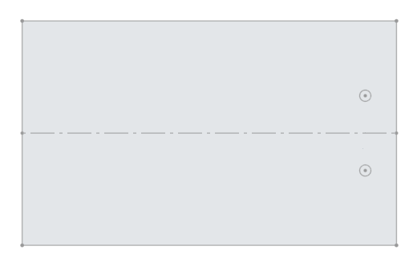
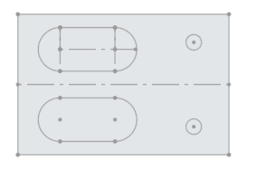
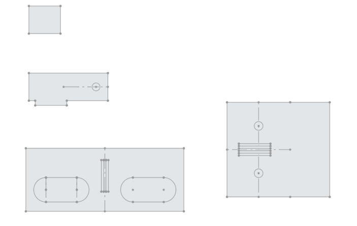

# Robot Progress Timeline

## Introduction

In this markdown we have attempted to document all the progress we have made on the most physical aspect of our project - the Braccio Arm.
It will be an attempt to collate all the progress and activities we undertook throughout the project. We will categorise the milestones by
the release period they took place in.

To see documentation for the time we spent on the Raspberry Pi and camera system, please look for another folder in our docs.

### MVP
At the early stage of the project, we initially planned to use two Braccio robotic arms working in coordination to pick up litter simultaneously. To achieve this, we borrowed two robotic arms from the uni and assembled them together as a team. The detailed assembly process can be found in ROBOT.md. However, due to time constraints, we ultimately decided to use only one robotic arm.

Following the instruction manual, we successfully installed Arduino IDE and established a connection between the board, the robotic arm, and a laptop. We then wrote simple control code to operate the robotic arm, enabling it to perform basic movement tests and also the safety position.

### Beta Release

Towards the tail end of our release to the client, we ran a few tests with the arm to see how precisely it could target a specific vector. To our horror
and utter dismay, there is a huge precision issue in the servos of the arm. 

When it comes to vertical movement (ie every servo excluding the base), this is a very minor issue in our current iteration of the project. Picking 
an object up ± 1cm from the centre of it won't be a huge issue until we try to pick up more complex (top-heavy) objects. On the other hand, when it
comes to horizontal movement, a few degrees of error in the base servo translate to huge margains of error at the farthest end of the robot's pickup
range (the most we measured was a horrific 15cm or so). The arm behaved strangely after completing its movement. We could physically twist it to the 
correct location, at which point it would lock up and stop moving. This tipped us off to suspect that the resistance the servos were facing while moving
was a likely culprit. It seems they had a tendency to stop just shy of the correct angle they were supposed to be targeting.

We didn't have time to fix this issue before our Beta Release to our client, but this suspicion had given us a few ideas ofpotential fixes.

### Final Release

In our first session after our beta release to the client, we set about tinkering with the base of the robot. We first had to test two things:

1) Was the base on too loose? Was there a lack of grip between the servo and the plastic connections causing it to lag behind the correct position?

2) Was the base on too tight? Was a high amount of tension between the base and servo causing it to not be able to turn as freely as it should?

While testing the former, we screwed on the base far too tight and caused the arm to almost tear itself in two. While testing the latter, we found that
there was no real change in the error. This left us to take to forums to look into what could be causing it. We spent a couple of hours just messing
around with different configurations of how tight to screw the base in and testing the starting angle of the base servo - to no avail.

In reality, the issue was quite simple. Servos are not precision devices. Being from a more theoretical field, we had simply sort of expected the
hardware to be theoretically flawless. However, the servos in the Braccio arm are fairly-budget friendly when compared to precision devices.
It would seem that just before reaching the target degree, the power in the servo dips slightly. This causes the servo to be unable to overcome
anymore resistance and stop just short of the target. So - we took to a software solution for this. We programmed the base servo to overshoot the
target by some number of degrees and then slowly "wiggle" its way back to the target.

#### Robot Stand

Moving into the last few weeks of development. We all agreed we needed to finalise a way of holding the arm and cameras in place. We started by defining
the requirements for the stand. These were:

1) A base to hold the arm in place

2) A pillar to support the platform that will hold the cameras and Raspberry Pi

After a first attempt at design using "onshape" (some free online CAD software), we created a base.

*see CAD files folder for .dwg file of all designs shown*

The holes on the left are 10mm in diameter and hold metal threaded poles that will support the afformentioned platform. The platform was initially
designed as such:

As can probably be seen at a glance, there were a few oversights in this design. Firstly, the cameras were facing the wrong way. There was also no
way to adjust the plane in which the cameras could view. They were stuck looking straight down. With this in mind we added a new requirement to
our list for the stand:

3) The platform must be adjustable in such a way the camera viewing angle can be changed as desired

Thus we went back to the drawing board and created this new design for the platform:

  
